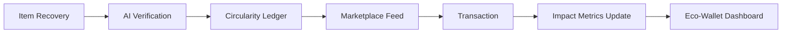

# EcoCycle: Circular Marketplace & Impact Analytics


**EcoCycle** is a high-fidelity circular economy platform designed to track material provenance and ecological impact across a local peer-to-peer network. It transforms secondary market trading into a data-driven sustainability mission.

## 🌍 Key Innovations

- **Asset Provenance Tracking:** A visual timeline for every item, documenting its recovery, verification, and transition history to ensure transparent circularity.
- **Impact Intelligence Dashboard:** Advanced sustainability metrics including CO2 offset calculations, material mass breakdown (Aluminum, Glass, Polymers), and mature tree equivalents.
- **Regional Recovery Mapping:** Mock geospatial visualization of localized circular density and material flow nodes.
- **Audit-Ready Ledger:** A cryptographic ledger of all points and fiat transactions, providing enterprise-grade transparency for environmental offsets.
- **Vision-Model verification (Simulated):** AI-driven asset condition assessment and pricing optimization.

## 🛠 Tech Stack

- **Core:** Next.js 16, TypeScript 5, React 19.
- **Charts:** Recharts (Donut, Area, and Bar analytics).
- **Motion:** Framer Motion (Page routing and micro-interactions).
- **UI:** Custom HSL design system with glassmorphic transparency and spring-physics cursors.
- **Persistence:** LocalStorage-based state hydration for wallet and listing data.

## 🗺 System Flow



## 💻 Local Development

1. **Clone the Repo:**
   ```bash
   git clone https://github.com/Abhi3975/circular-market.git
   ```
2. **Install Dependencies:**
   ```bash
   npm install
   ```
3. **Run Dev Server:**
   ```bash
   npm run dev
   ```

## 📄 License
Distributed under the MIT License. See `LICENSE` for more information.
